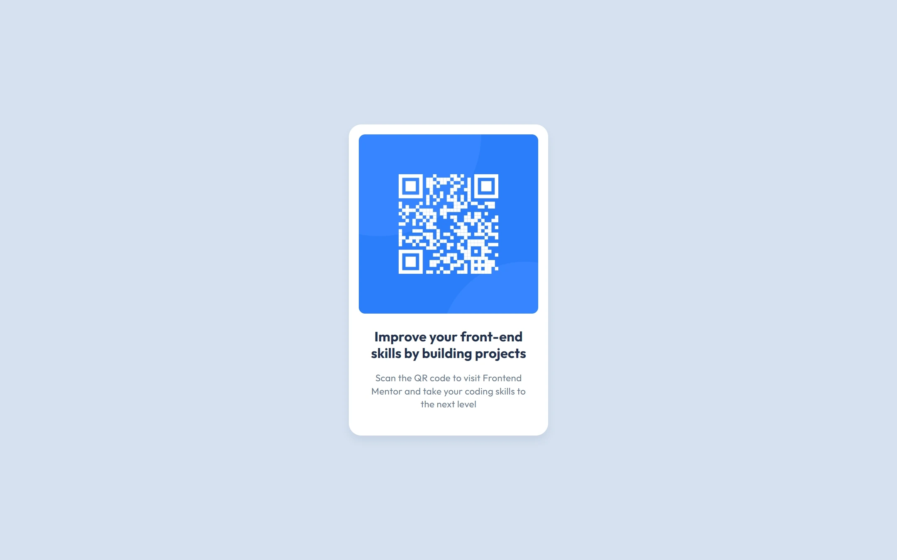

# Local Weather App

This project is a simple app that consume API to show weater based on current location. If permission to get location is denied, this app will show "unknown".

🔗 **[Live Demo](https://hunafazaky.github.io/local-weather-app)** 

## Table of contents
- [Overview](#overview)
  - [Screenshot](#screenshot)
- [Development](#development)
  - [Built with](#built-with)
  - [What I learned](#what-i-learned)
  - [Next Possible Development](#next-possible-development)
- [Author](#author)

## Overview

### Screenshot

#### Desktop View | Mobile View

 

## Development

### Built with

This project was built entirely from scratch using core web technologies without any additional frameworks:
- **Semantic HTML5 markup:** To ensure a meaningful and accessible document structure.
- **CSS Flexbox:** Used for layouting, specifically to ensure the QR card stays perfectly centered on the screen.
- **CSS custom properties (Variables):** For efficient color and theme management.

### What I learned

Through this challenge, I reinforced my fundamental web layouting skills. I focused on ensuring the card maintains good proportions and stays perfectly centered across different viewport sizes, adapting smoothly from small mobile phones to large desktop monitors.

### Next Possible Development

In the future, I plan to turn this static component into a fully interactive application with the following features:
- Allow users to input their own text or URL to generate custom QR codes dynamically.
- Add a download feature so users can save their generated QR codes as images.

## Author

- Website - [Hunafa Zaky](https://hunafazaky.github.io/)
- Frontend Mentor - [@hunafazaky](https://www.frontendmentor.io/profile/hunafazaky)